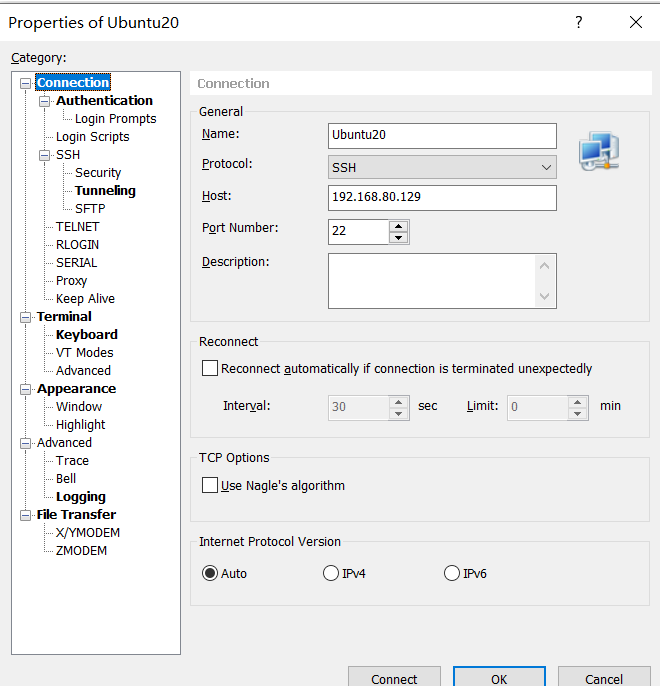

@[TOC]

# 1. Install Ubuntu20.04 and set SSH remote login

```bash
#change passwd for root user
sudo passwd root

su - root
apt update
apt install openssh-server
sudo systemctl status ssh
# set ssh running when pc start
sudo systemctl enable ssh

ip addr show
```


# 2. Install Environment Dependencies 

```bash
sudo apt-get install build-essential g++ python-dev autotools-dev libicu-dev build-essential libbz2-dev libboost-all-dev
```

## 2.1 Install Boost Library
### 2.1.1. Download and move to Ubuntu

下载地址： [https://www.boost.org/users/history/version_1_85_0.html](https://www.boost.org/users/history/version_1_85_0.html)

### 2.1.2 . unzip

```bash
tar xzvf boost_1_85_0.tar.gz
```

### 2.1.3. Get into the directory

```bash
cd boost_1_85_0/
```

```bash
beza@beza:~/Cluster_Chatroom$ ls
boost_1_85_0  boost_1_85_0.tar.gz

beza@beza:~/Cluster_Chatroom$ cd boost_1_85_0/
beza@beza:~/Cluster_Chatroom/boost_1_85_0$ ls
boost            boostcpp.jam  boost.png      bootstrap.sh  index.htm   INSTALL  libs             more       rst.css  tools
boost-build.jam  boost.css     bootstrap.bat  doc           index.html  Jamroot  LICENSE_1_0.txt  README.md  status
```

### 2.1.4. Set bootstrap for Boost 

#### 2.1.4.1 set --prefix=/usr/

```bash
./bootstrap.sh --prefix=/usr/
```

Wait for a while 

```bash
Building B2 engine..

###
###
### Using 'gcc' toolset.
###
###

g++ (Ubuntu 11.2.0-19ubuntu1) 11.2.0
Copyright (C) 2021 Free Software Foundation, Inc.
This is free software; see the source for copying conditions.  There is NO
warranty; not even for MERCHANTABILITY or FITNESS FOR A PARTICULAR PURPOSE.


###
###

> g++ -x c++ -std=c++11 -pthread -O2 -s -DNDEBUG bindjam.cpp builtins.cpp class.cpp command.cpp compile.cpp constants.cpp cwd.cpp debug.cpp debugger.cpp execcmd.cpp execnt.cpp execunix.cpp filent.cpp filesys.cpp fileunix.cpp frames.cpp function.cpp glob.cpp hash.cpp hcache.cpp hdrmacro.cpp headers.cpp jam_strings.cpp jam.cpp jamgram.cpp lists.cpp make.cpp make1.cpp md5.cppmem.cpp modules.cpp native.cpp option.cpp output.cpp parse.cpp pathnt.cpp pathsys.cpp pathunix.cpp regexp.cpp rules.cpp scan.cpp search.cpp startup.cpp tasks.cpp timestamp.cpp value.cpp variable.cpp w32_getreg.cpp mod_jam_builtin.cpp mod_jam_class.cpp mod_jam_errors.cpp mod_jam_modules.cpp mod_order.cpp mod_path.cpp mod_property_set.cpp mod_regex.cpp mod_sequence.cpp mod_set.cpp mod_string.cpp mod_summary.cpp mod_sysinfo.cpp mod_version.cpp -o b2


tools/build/src/engine/b2
Unicode/ICU support for Boost.Regex?... /usr
Generating B2 configuration in project-config.jam for gcc...

Bootstrapping is done. To build, run:

    ./b2

To generate header files, run:

    ./b2 headers

The configuration generated uses gcc to build by default. If that is
unintended either use the --with-toolset option or adjust configuration, by
editing 'project-config.jam'.

Further information:

   - Command line help:
     ./b2 --help

   - Getting started guide:
     http://www.boost.org/more/getting_started/unix-variants.html

   - B2 documentation:
     http://www.boost.org/build/
```

There will be one more file in the folder named b2, which is a executable program

```bash
ls
--------------------------------------------------------------
b2     boost-build.jam  boost.css  bootstrap.bat  doc        index.html  Jamroot  LICENSE_1_0.txt  project-config.jam  rst.css  tools
boost  boostcpp.jam     boost.png  bootstrap.sh   index.htm  INSTALL     libs     more             README.md           status

```

#### 2.1.4.2 Exceute the b2

```bash
./b2

-----------------------------
...updated 1843 targets...
The Boost C++ Libraries were successfully built!
The following directory should be added to compiler include paths:
    /home/beza/Cluster_Chatroom/boost_1_85_0
The following directory should be added to linker library paths:
    /home/beza/Cluster_Chatroom/boost_1_85_0/stage/lib

```

#### 2.1.4.3 Install the boost

```c
sudo ./b2 install

--------------------
ln-UNIX /usr/lib/libboost_chrono.so
boost-install.generate-cmake-config- bin.v2/libs/chrono/build/install/boost_chrono-config.cmake
common.copy /usr/lib/cmake/boost_chrono-1.85.0/libboost_chrono-variant-shared.cmake
common.copy /usr/lib/libboost_atomic.so.1.85.0
boost-install.generate-cmake-config-version- bin.v2/libs/chrono/build/install/boost_chrono-config-version.cmake
boost-install.generate-cmake-config- bin.v2/libs/atomic/build/install/boost_atomic-config.cmake
ln-UNIX /usr/lib/libboost_atomic.so
boost-install.generate-cmake-config-version- bin.v2/libs/atomic/build/install/boost_atomic-config-version.cmake
common.copy /usr/lib/cmake/boost_chrono-1.85.0/boost_chrono-config.cmake
common.copy /usr/lib/cmake/boost_chrono-1.85.0/boost_chrono-config-version.cmake
common.copy /usr/lib/cmake/boost_atomic-1.85.0/boost_atomic-config.cmake
common.copy /usr/lib/cmake/BoostDetectToolset-1.85.0.cmake
common.copy /usr/lib/cmake/boost_atomic-1.85.0/libboost_atomic-variant-shared.cmake
common.copy /usr/lib/cmake/boost_atomic-1.85.0/boost_atomic-config-version.cmake
common.copy /usr/lib/cmake/Boost-1.85.0/BoostConfig.cmake
common.copy /usr/lib/cmake/Boost-1.85.0/BoostConfigVersion.cmake

...updated 16390 targets...

```

#### 2.1.4.4 Testcase

Filename：boost_test.cpp

```cpp
#include <iostream>
#include <boost/bind/bind.hpp>
#include <string>
using namespace std;
 
class Hello{
	public:
		void say(string name)
		{
			cout << name << "Nice to meet you!" << endl;
		}
};
 
int main()
{
	Hello h;
	auto func=boost::bind(&Hello::say,&h,"Hey boy ");
	func();
	return 0;
}
```


```bash
beza@beza:~/Cluster_Chatroom$ ls
boost_1_85_0  boost_1_85_0.tar.gz  boost_test.cpp

--------------------------------------------------------------
beza@beza:~/Cluster_Chatroom$ g++ boost_test.cpp
In file included from /usr/include/boost/bind.hpp:30,
                 from boost_test.cpp:2:
/usr/include/boost/bind.hpp:36:1: note: ‘#pragma message: The practice of declaring the Bind placeholders (_1, _2, ...) in the global namespace is deprecated. Please use <boost/bind/bind.hpp> + using namespace boost::placeholders, or define BOOST_BIND_GLOBAL_PLACEHOLDERS to retain the current behavior.’
   36 | BOOST_PRAGMA_MESSAGE(
      | ^~~~~~~~~~~~~~~~~~~~
      
--------------------------------------------------------------
beza@beza:~/Cluster_Chatroom$ g++ boost_test.cpp
beza@beza:~/Cluster_Chatroom$ ls
a.out  boost_1_85_0  boost_1_85_0.tar.gz  boost_test.cpp
beza@beza:~/Cluster_Chatroom$ ./a.out
Hey boy Nice to meet you!

```

## 2.2 Install muduo

### 2.2.1. 下载muduo库源代码

[https://github.com/chenshuo/muduo/releases/tag/v2.0.2](https://github.com/chenshuo/muduo/releases/tag/v2.0.2)


### 2.2.2. 解压安装muduo
```bash
sudo apt-get install cmake

tar -zxvf muduo-2.0.2.tar.gz


cd muduo-2.0.2

# 编辑CMakeLists.txt文件，注释第十三option行，保存退出
sudo vim CMakeLists.txt

# 在Ubuntu20.4版本里无比丝滑，但是22.04一直安装不了
./build.sh

./build.sh install

cd build/release-install-cpp11/include/

sudo mv muduo/ /usr/include/

cd ../lib/
sudo mv * /usr/local/lib/

```

### 2.2.3. Testcase

```cpp
#include <muduo/net/TcpServer.h>
#include <muduo/base/Logging.h>
#include <boost/bind/bind.hpp>
#include <muduo/net/EventLoop.h>

using namespace boost::placeholders;  // 添加这一行

// 使用muduo开发回显服务器
class EchoServer {
public:
	EchoServer(muduo::net::EventLoop* loop,
		const muduo::net::InetAddress& listenAddr);
  	void start();
private:
	void onConnection(const muduo::net::TcpConnectionPtr& conn);
	void onMessage(const muduo::net::TcpConnectionPtr& conn,
                 muduo::net::Buffer* buf,
		 muduo::Timestamp time);
	muduo::net::TcpServer server_;
};
EchoServer::EchoServer(muduo::net::EventLoop* loop,
 			const muduo::net::InetAddress& listenAddr)
  	: server_(loop, listenAddr, "EchoServer")
{
	server_.setConnectionCallback(boost::bind(&EchoServer::onConnection, this, _1));
  	server_.setMessageCallback(boost::bind(&EchoServer::onMessage, this, _1, _2, _3));
}
void EchoServer::start()
{
	server_.start();
}
void EchoServer::onConnection(const muduo::net::TcpConnectionPtr& conn) 
{ LOG_INFO << "EchoServer - " << conn->peerAddress().toIpPort() << " -> "
           << conn->localAddress().toIpPort() << " is " << (conn->connected() ? "UP" : "DOWN");
}
void EchoServer::onMessage(const muduo::net::TcpConnectionPtr& conn,
				 muduo::net::Buffer*buf,
				 muduo::Timestamp time)
{
  	// 接收到所有的消息，然后回显
  	muduo::string msg(buf->retrieveAllAsString());
	LOG_INFO << conn->name() << " echo " << msg.size() << " bytes, "
           	 << "data received at " << time.toString(); conn->send(msg);
}
int main()
{
	LOG_INFO << "pid = " << getpid();
	muduo::net::EventLoop loop;
  	muduo::net::InetAddress listenAddr(8888);
	EchoServer server(&loop, listenAddr);
 	server.start();
	loop.loop();
}
```

```bash
g++ muduo.cpp -lmuduo_net -lmuduo_base -lpthread -std=c++11
```

Open two terminal for testing：
- 1st terminal run a.out；
- 2nd terminal run the following input：

```bash
echo "Hello world"|nc localhost 8888
```


## 2.3 Install json

```bash
sudo apt-get install libjsoncpp-dev
sudo apt-get install libjson-c-dev
```

Verify location and compile command

```bash
# 检查是否安装成功
ls /usr/include/jsoncpp/json/

# header
#include <jsoncpp/json/json.h>

# compile
g++ -ljsoncpp

----------------------------------
ls /usr/include/json-c/
#include <json-c/json.h>
g++ -ljson-c
```

## 2.4 Install Mysql and Remote Login

### 2.4.1 Install mysql and setup the config
```bash
sudo apt install -y  mysql-server
sudo ufw disable
sudo ufw allow 3306

# Comment or change the bind-address = 0.0.0.0 
sudo vim /etc/mysql/mysql.conf.d/mysqld.cnf

！！ 重启电脑

sudo mysql -uroot

```

### 2.4.2 change mysql root password and grant the authority
```bash
alter user 'root'@'localhost' identified with mysql_native_password by 'root';

exit

mysql -u root -p

use mysql

exit

mysql -u root -p

use mysql

update user set host='%' where user='root';

grant all on *.* to 'root'@'%';

flush privileges;

exit

```

```bash
systemctl start mysql.service
systemctl restart mysql.service
systemctl stop mysql.service
```

### 2.4.3  Navicate remote login

[https://github.com/shuhongfan/NavicatCracker/tree/main](https://github.com/shuhongfan/NavicatCracker/tree/main)


## 2.5 Install Redis

### 2.5.1 Installation command

```bash
sudo apt-get update
sudo apt-get install redis-server

sudo vim /etc/redis/redis.conf
Port No.：6379
Comment the Line 68: 127.0.0.1
Set the password in Line 507. （Ubuntu20.04）
The password is 1234567.

sudo ufw allow 6379

service redis restart
sudo netstat -talnp
```

### 2.5.2 local connect

```bash
redis-cli
---------------------------
auth 1234567  <-password set
```

### 2.5.3 Quick Redis Remote Connect


## 2.6  Install Nginx
TODO


## 
