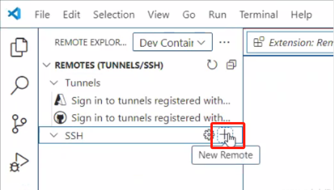
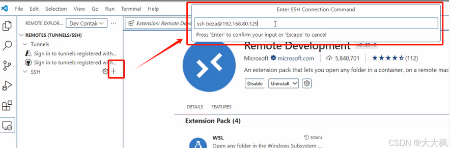
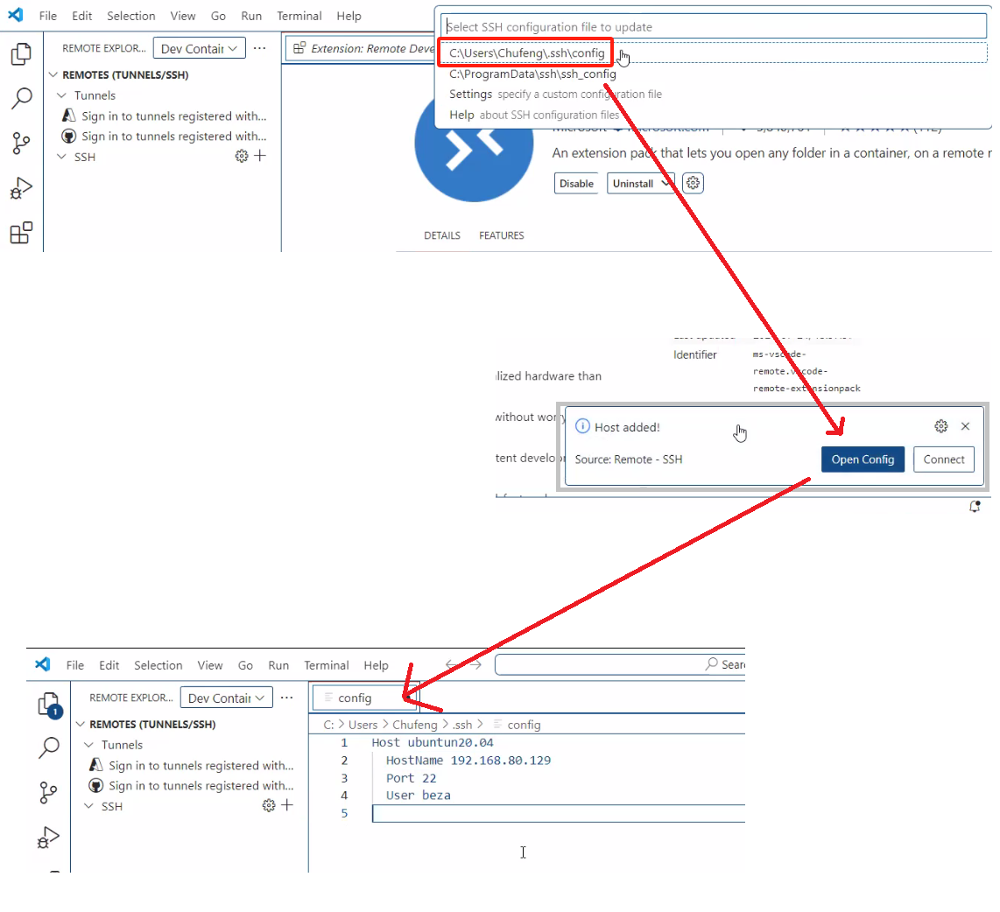
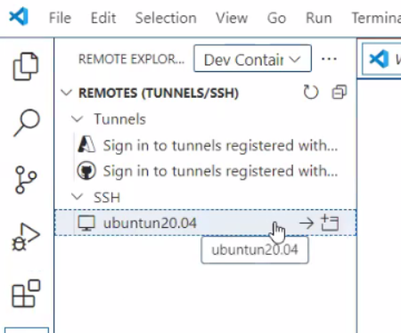
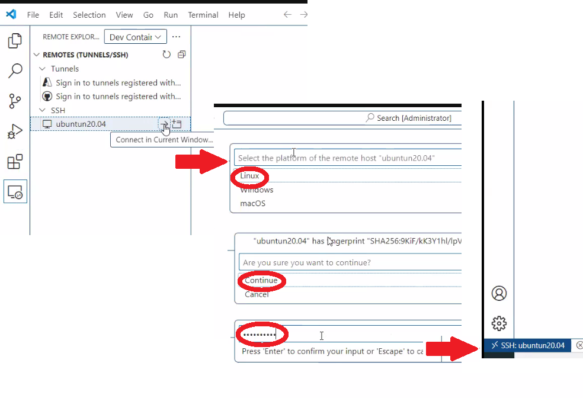
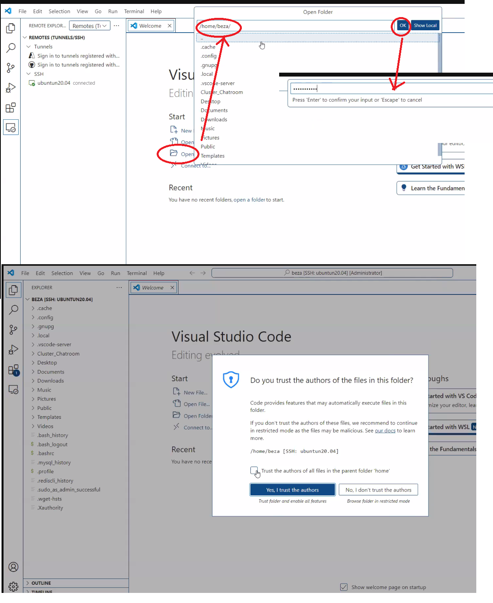
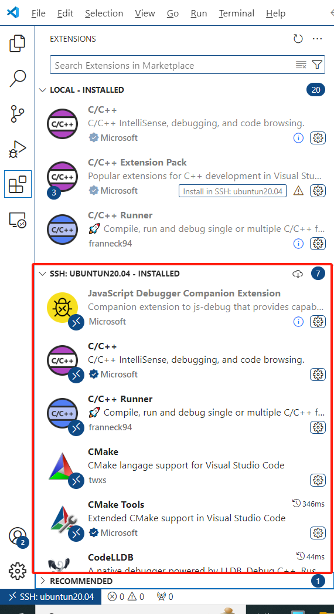

@[TOC]

# 1. running the VScode in Admin mode
管理员模式打开VScode

# 2. Install the plugin

```cpp
Remote Development
C/C++
Code Runner
CMake
```

# 3. New Remote



# 4. Enther the command at the top blanket column in VS Code


# 5. Setup the ssh config file

# 6. Restart VScode
The VScode will auto identify the remote server



# 7. Connect to the Server



# 8. Open the remote folder


