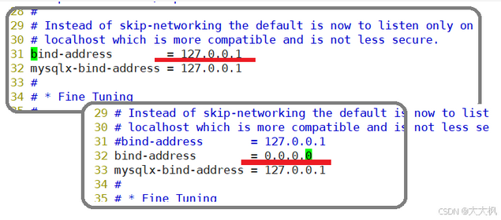
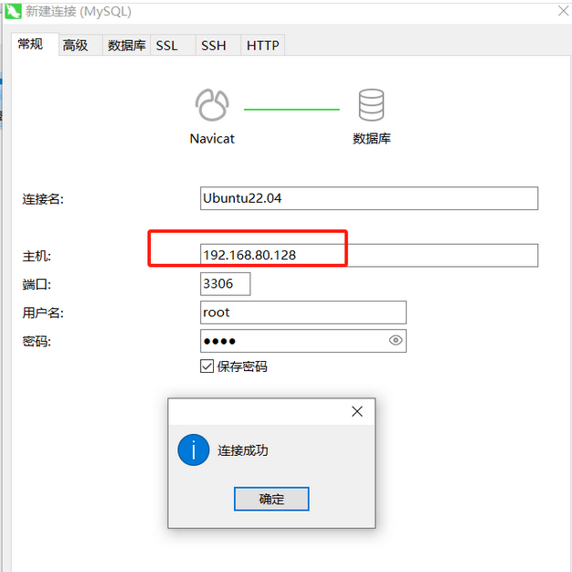

@[TOC]

# 1. 安装指令

```cpp
sudo apt update 
sudo apt install -y  mysql-server
```

# 2. 更改密码

```bash
sudo mysql -uroot

alter user 'root'@'localhost' identified with mysql_native_password by 'root';

```

# 3. 退出使用密码重新登录

```bash
mysql> exit
-------------------------------------


mysql -uroot -p
Enter password:
----------------------------------------
Welcome to the MySQL monitor.  Commands end with ; or \g.
Your MySQL connection id is 9
Server version: 8.0.28-0ubuntu4 (Ubuntu)

Copyright (c) 2000, 2022, Oracle and/or its affiliates.

Oracle is a registered trademark of Oracle Corporation and/or its
affiliates. Other names may be trademarks of their respective
owners.

Type 'help;' or '\h' for help. Type '\c' to clear the current input statement.

mysql>

```

# 4. 配置远程连接

```bash
mysql -u root -p

use mysql

update user set host='%' where user='root';

grant all on *.* to 'root'@'%';

flush privileges;

grant all on *.* to 'root'@'%';

flush privileges;

exit
```

# 5. 修改bind-address = 0.0.0.0 | 或者注释掉

```bash
sudo vim /etc/mysql/mysql.conf.d/mysqld.cnf
```

# 6. 关闭防火墙

```bash
sudo ufw disable
```

# 7. 设置端口3306开放

```bash
sudo ufw allow 3306
```


# Navicat 16

[https://github.com/shuhongfan/NavicatCracker/tree/main](https://github.com/shuhongfan/NavicatCracker/tree/main)


