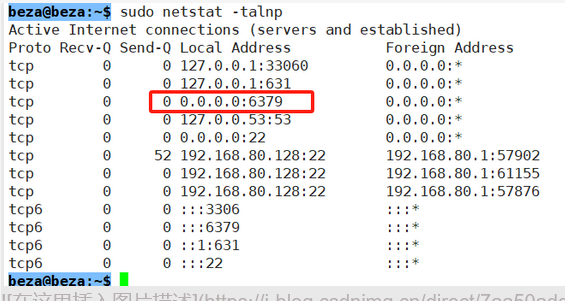
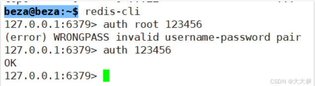
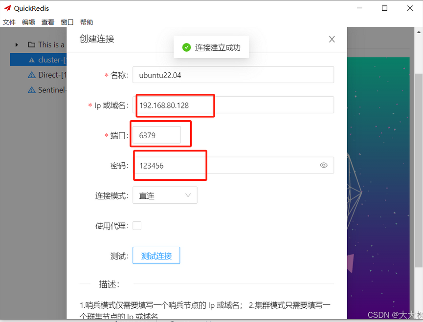

@[TOC]

# 1. Instalation

```bash
sudo apt-get update
sudo apt-get install redis-server
```
# 2. redis status

```bash
service redis status
```

# 3. redis installation location

```bash
whereis redis 

----------------
redis: /etc/redis
```

# 4. comment the bind addr, and set the redis password

```bash
sudo vim /etc/redis/redis.conf
```

Port No.：6379

Comment the Line 68: 127.0.0.1

Set the password in Line 790.

The password is 123456.


# 5. Set port 6379 open

```bash
sudo ufw allow 6379
```


# 6. restart redis

```bash
service redis restart
sudo netstat -talnp
```
if the port 6379 has 0.0.0.0 in front，configure successfully.


# 6. Local connect 

```bash
redis-cli
---------------------------
auth 123456  <-password set

```


# 7. QuickRedis 远程连接


