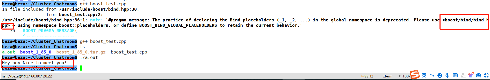

@[TOC]

# 1. Download and move to Ubuntu

下载地址： [https://www.boost.org/users/history/version_1_85_0.html](https://www.boost.org/users/history/version_1_85_0.html)

# 2. unzip

```bash
tar xzvf boost_1_85_0.tar.gz
```

# 3. Get into the directory

```bash
cd boost_1_85_0/
```

```bash
beza@beza:~/Cluster_Chatroom$ ls
boost_1_85_0  boost_1_85_0.tar.gz

beza@beza:~/Cluster_Chatroom$ cd boost_1_85_0/
beza@beza:~/Cluster_Chatroom/boost_1_85_0$ ls
boost            boostcpp.jam  boost.png      bootstrap.sh  index.htm   INSTALL  libs             more       rst.css  tools
boost-build.jam  boost.css     bootstrap.bat  doc           index.html  Jamroot  LICENSE_1_0.txt  README.md  status
```

# 4. Set bootstrap for Boost 
## 4.1 set --prefix=/usr/
```bash
./bootstrap.sh --prefix=/usr/
```

Wait for a while 
```bash
Building B2 engine..

###
###
### Using 'gcc' toolset.
###
###

g++ (Ubuntu 11.2.0-19ubuntu1) 11.2.0
Copyright (C) 2021 Free Software Foundation, Inc.
This is free software; see the source for copying conditions.  There is NO
warranty; not even for MERCHANTABILITY or FITNESS FOR A PARTICULAR PURPOSE.


###
###

> g++ -x c++ -std=c++11 -pthread -O2 -s -DNDEBUG bindjam.cpp builtins.cpp class.cpp command.cpp compile.cpp constants.cpp cwd.cpp debug.cpp debugger.cpp execcmd.cpp execnt.cpp execunix.cpp filent.cpp filesys.cpp fileunix.cpp frames.cpp function.cpp glob.cpp hash.cpp hcache.cpp hdrmacro.cpp headers.cpp jam_strings.cpp jam.cpp jamgram.cpp lists.cpp make.cpp make1.cpp md5.cppmem.cpp modules.cpp native.cpp option.cpp output.cpp parse.cpp pathnt.cpp pathsys.cpp pathunix.cpp regexp.cpp rules.cpp scan.cpp search.cpp startup.cpp tasks.cpp timestamp.cpp value.cpp variable.cpp w32_getreg.cpp mod_jam_builtin.cpp mod_jam_class.cpp mod_jam_errors.cpp mod_jam_modules.cpp mod_order.cpp mod_path.cpp mod_property_set.cpp mod_regex.cpp mod_sequence.cpp mod_set.cpp mod_string.cpp mod_summary.cpp mod_sysinfo.cpp mod_version.cpp -o b2


tools/build/src/engine/b2
Unicode/ICU support for Boost.Regex?... /usr
Generating B2 configuration in project-config.jam for gcc...

Bootstrapping is done. To build, run:

    ./b2

To generate header files, run:

    ./b2 headers

The configuration generated uses gcc to build by default. If that is
unintended either use the --with-toolset option or adjust configuration, by
editing 'project-config.jam'.

Further information:

   - Command line help:
     ./b2 --help

   - Getting started guide:
     http://www.boost.org/more/getting_started/unix-variants.html

   - B2 documentation:
     http://www.boost.org/build/
```
There will be one more file in the folder named b2, which is a executable program

```bash
ls
--------------------------------------------------------------
b2     boost-build.jam  boost.css  bootstrap.bat  doc        index.html  Jamroot  LICENSE_1_0.txt  project-config.jam  rst.css  tools
boost  boostcpp.jam     boost.png  bootstrap.sh   index.htm  INSTALL     libs     more             README.md           status

```

## 4.2 Exceute the b2

```bash
./b2

-----------------------------
...updated 1843 targets...
The Boost C++ Libraries were successfully built!
The following directory should be added to compiler include paths:
    /home/beza/Cluster_Chatroom/boost_1_85_0
The following directory should be added to linker library paths:
    /home/beza/Cluster_Chatroom/boost_1_85_0/stage/lib

```

## 4.3 Install the boost

```c
sudo ./b2 install

--------------------
ln-UNIX /usr/lib/libboost_chrono.so
boost-install.generate-cmake-config- bin.v2/libs/chrono/build/install/boost_chrono-config.cmake
common.copy /usr/lib/cmake/boost_chrono-1.85.0/libboost_chrono-variant-shared.cmake
common.copy /usr/lib/libboost_atomic.so.1.85.0
boost-install.generate-cmake-config-version- bin.v2/libs/chrono/build/install/boost_chrono-config-version.cmake
boost-install.generate-cmake-config- bin.v2/libs/atomic/build/install/boost_atomic-config.cmake
ln-UNIX /usr/lib/libboost_atomic.so
boost-install.generate-cmake-config-version- bin.v2/libs/atomic/build/install/boost_atomic-config-version.cmake
common.copy /usr/lib/cmake/boost_chrono-1.85.0/boost_chrono-config.cmake
common.copy /usr/lib/cmake/boost_chrono-1.85.0/boost_chrono-config-version.cmake
common.copy /usr/lib/cmake/boost_atomic-1.85.0/boost_atomic-config.cmake
common.copy /usr/lib/cmake/BoostDetectToolset-1.85.0.cmake
common.copy /usr/lib/cmake/boost_atomic-1.85.0/libboost_atomic-variant-shared.cmake
common.copy /usr/lib/cmake/boost_atomic-1.85.0/boost_atomic-config-version.cmake
common.copy /usr/lib/cmake/Boost-1.85.0/BoostConfig.cmake
common.copy /usr/lib/cmake/Boost-1.85.0/BoostConfigVersion.cmake

...updated 16390 targets...

```

## 4.4 Testcase

Filename：boost_test.cpp

```cpp
#include <iostream>
#include <boost/bind/bind.hpp>
#include <string>
using namespace std;
 
class Hello{
	public:
		void say(string name)
		{
			cout << name << "Nice to meet you!" << endl;
		}
};
 
int main()
{
	Hello h;
	auto func=boost::bind(&Hello::say,&h,"Hey boy ");
	func();
	return 0;
}
```


```bash
beza@beza:~/Cluster_Chatroom$ ls
boost_1_85_0  boost_1_85_0.tar.gz  boost_test.cpp

--------------------------------------------------------------
beza@beza:~/Cluster_Chatroom$ g++ boost_test.cpp
In file included from /usr/include/boost/bind.hpp:30,
                 from boost_test.cpp:2:
/usr/include/boost/bind.hpp:36:1: note: ‘#pragma message: The practice of declaring the Bind placeholders (_1, _2, ...) in the global namespace is deprecated. Please use <boost/bind/bind.hpp> + using namespace boost::placeholders, or define BOOST_BIND_GLOBAL_PLACEHOLDERS to retain the current behavior.’
   36 | BOOST_PRAGMA_MESSAGE(
      | ^~~~~~~~~~~~~~~~~~~~
      
--------------------------------------------------------------
beza@beza:~/Cluster_Chatroom$ g++ boost_test.cpp
beza@beza:~/Cluster_Chatroom$ ls
a.out  boost_1_85_0  boost_1_85_0.tar.gz  boost_test.cpp
beza@beza:~/Cluster_Chatroom$ ./a.out
Hey boy Nice to meet you!

```


